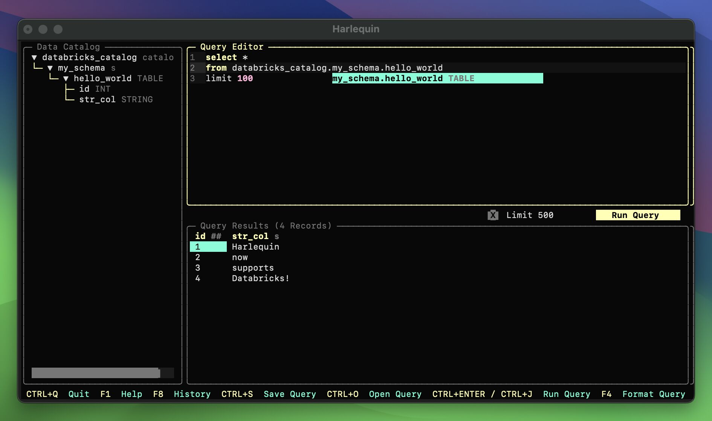

# harlequin-databricks

[](https://pypi.org/project/harlequin-databricks/)
[](https://anaconda.org/conda-forge/harlequin-databricks)
[](https://pypi.org/project/harlequin-databricks/)
[](https://github.com/alexmalins/harlequin-databricks/actions/workflows/code_quality_checks.yml)
[](https://github.com/astral-sh/ruff)
[](https://github.com/alexmalins/harlequin-databricks/blob/main/LICENSE)
[](https://pepy.tech/project/harlequin-databricks)

A [Harlequin](https://harlequin.sh) adapter for Databricks. Supports connecting to Databricks SQL
warehouses or Databricks Runtime (DBR) interactive clusters.




## Installation

`harlequin-databricks` depends on `harlequin`, so installing this package using any of the methods
below will also install `harlequin`.

### Using uv

The recommended way to install `harlequin-databricks` is using `uv`:

```bash
uv tool install harlequin --with harlequin-databricks
```

This command will install `harlequin` with the databricks adapter into an isolated environment and
add it to your PATH so you can easily run the executable.

### Alternative installation methods

Alternatively, if you know what you're doing, after installing Python 3.9 or above, install
`harlequin-databricks` using pip, pipx, poetry, or any other program that can install Python
packages from PyPI. For example:

```bash
pip install harlequin-databricks
```


## Connecting to Databricks

To connect to Databricks you are going to need to provide as CLI arguments:

- server-hostname
- http-path
- credentials for one of the following authentication methods:
  - a personal access token (PAT)
  - a username and password
  - an OAuth U2M type
  - a service principle client ID and secret for OAuth M2M


### Personal Access Token (PAT) authentication:

```bash
harlequin -a databricks --server-hostname ***.cloud.databricks.com --http-path /sql/1.0/endpoints/*** --access-token dabpi***
```

### Username and password (basic) authentication:

```bash
harlequin -a databricks --server-hostname ***.cloud.databricks.com --http-path /sql/1.0/endpoints/*** --username *** --password ***
```

### OAuth U2M authentication:

For [OAuth user-to-machine (U2M) authentication](https://docs.databricks.com/en/dev-tools/python-sql-connector.html#auth-u2m)
supply either `databricks-oauth` or `azure-oauth` to the `--auth-type` CLI argument:

```bash
harlequin -a databricks --server-hostname ***.cloud.databricks.com --http-path /sql/1.0/endpoints/*** --auth-type databricks-oauth
```

### OAuth M2M authentication:

For [OAuth machine-to-machine (M2M) authentication](https://docs.databricks.com/en/dev-tools/python-sql-connector.html#oauth-machine-to-machine-m2m-authentication)
you need to `pip install databricks-sdk` as an additional dependency
([databricks-sdk](https://github.com/databricks/databricks-sdk-py) is an optional dependency of
`harlequin-databricks`) and supply `--client-id` and `--client-secret` CLI arguments:

```bash
harlequin -a databricks --server-hostname ***.cloud.databricks.com --http-path /sql/1.0/endpoints/*** --client-id *** --client-secret ***
```


## Store an alias for your connection string

We recommend you include an alias for your connection string in your `.bash_profile`/`.zprofile` so
you can launch harlequin-databricks with a short command like `hdb` each time.

Run this command
(once) to create the alias:

```bash
echo 'alias hdb="harlequin -a databricks --server-hostname ***.cloud.databricks.com --http-path /sql/1.0/endpoints/*** --access-token dabpi***"' >> .bash_profile    
```


## Using Unity Catalog and want fast Data Catalog indexing?

Supply the `--skip-legacy-indexing` command line flag if you do not care about legacy metastores
(e.g. `hive_metastore`) being indexed in Harlequin's Data Catalog pane.

This flag will skip indexing of old non-Unity Catalog metastores (i.e. they won't appear in the
Data Catalog pane with this flag).

Because of the way legacy Databricks metastores works, a separate SQL query is required to fetch
the metadata of each table in a legacy metastore. This means indexing them for Harlequin's Data Catalog pane is slow.

Databricks's Unity Catalog upgrade brought
[Information Schema](https://docs.databricks.com/en/sql/language-manual/sql-ref-information-schema.html),
which allows harlequin-databricks to fetch metadata for all Unity Catalog assets with only two SQL queries.

So if your Databricks instance is running Unity Catalog, and you no longer care about the legacy
metastores, setting the `--skip-legacy-indexing` CLI flag is recommended as it will mean
much faster indexing & refreshing of the assets in the Data Catalog pane.


## Initialization Scripts

Each time you start Harlequin, it will execute SQL commands from a Databricks initialization script.
For example:

```sql
USE CATALOG my_catalog;
SET TIME ZONE 'Asia/Tokyo';
DECLARE yesterday DATE DEFAULT CURRENT_DATE - INTERVAL '1' DAY;
```

Multi-line SQL is allowed, but must be terminated by a semicolon.

### Configuring the Script Location

By default, Harlequin will execute the script found at `~/.databricksrc`. However, you can provide
a different path using the `--init-path` option (aliased to `-i` or `-init`):

```bash
harlequin -a databricks --init-path /path/to/my/script.sql
```

### Disabling Initialization

If you would like to open Harlequin without running the script you have at `~/.databricksrc`, you
can either pass a nonexistent path (or `/dev/null`) to the option above, or start Harlequin with
the `--no-init` option:

```bash
harlequin -a databricks --no-init
```


## Other CLI options:

For more details on other command line options, run:

```bash
harlequin --help
```

For more information, see the
[harlequin-databricks Docs](https://harlequin.sh/docs/databricks/index).


## Issues, Contributions and Feature Requests

Please report bugs/issues with this adapter via the GitHub
[issues](https://github.com/alexmalins/harlequin-databricks/issues) page. You are welcome to
attempt fixes yourself by forking this repo then opening a [PR](https://github.com/alexmalins/harlequin-databricks/pulls).

For feature suggestions, please post in the
[discussions](https://github.com/alexmalins/harlequin-databricks/discussions).


## Special thanks to...

[Ted Conbeer](https://github.com/tconbeer), [Josh Temple](https://github.com/joshtemple) &
[Tyler Hillery](https://github.com/TylerHillery).
